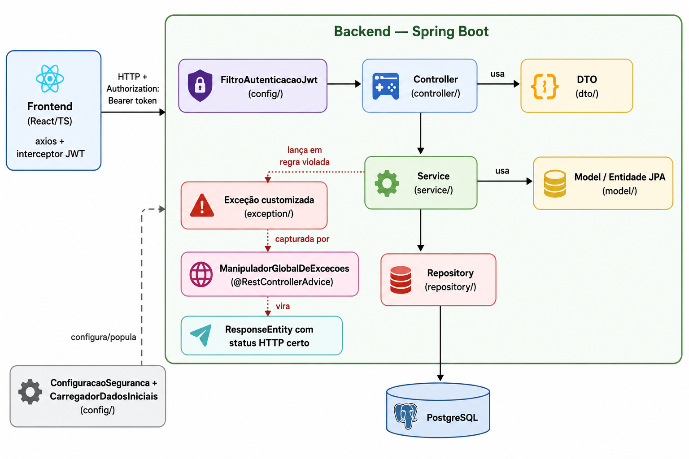

# MatriculaFácil

Sistema de matrícula universitária desenvolvido como projeto de treinamento da **CATI Jr.** (Trainee 2026): catálogo de disciplinas, inscrição e cancelamento de matrícula, histórico do aluno e edição de perfil.



## Deploy

O projeto está publicado e funcionando online:

- **Site**: https://matricula-facil-app.onrender.com
- **Documentação da API (Swagger)**: https://matricula-facil.onrender.com/swagger-ui/index.html

**Usuário de teste**:
- email: `aluno@matriculafacil.com`
- senha: `senha123`

**Onde está hospedado**: o site e a API ficam no **Render**, e o banco de dados (PostgreSQL) fica no **Neon**.

**Aviso importante**: como o plano usado é gratuito, o site "desliga" sozinho depois de um tempo sem uso. Isso quer dizer que, se ninguém acessar por um tempo, a primeira vez que alguém abrir o link pode demorar de 30 a 50 segundos pra carregar (o site está "ligando" de novo). Depois disso, ele funciona normal.

## Estrutura

| Pasta | Descrição |
|---|---|
| [`backend/`](backend/README.md) | API REST em Spring Boot (Java) |
| [`frontend-example/`](frontend-example/README.md) | Interface web em React + TypeScript |

Cada pasta tem seu próprio README com detalhes de tecnologias, endpoints/telas e como rodar isoladamente.

## Como rodar tudo localmente

```bash
# 1. Banco de dados
docker compose up -d postgres

# 2. Backend (porta 8080)
cd backend
./mvnw spring-boot:run

# 3. Frontend (porta 5173)
cd frontend-example
npm install
npm run dev
```

**Usuário de teste** (criado automaticamente pelo seed do backend):
- email: `aluno@matriculafacil.com`
- senha: `senha123`

Documentação da API (Swagger): `http://localhost:8080/swagger-ui/index.html`
